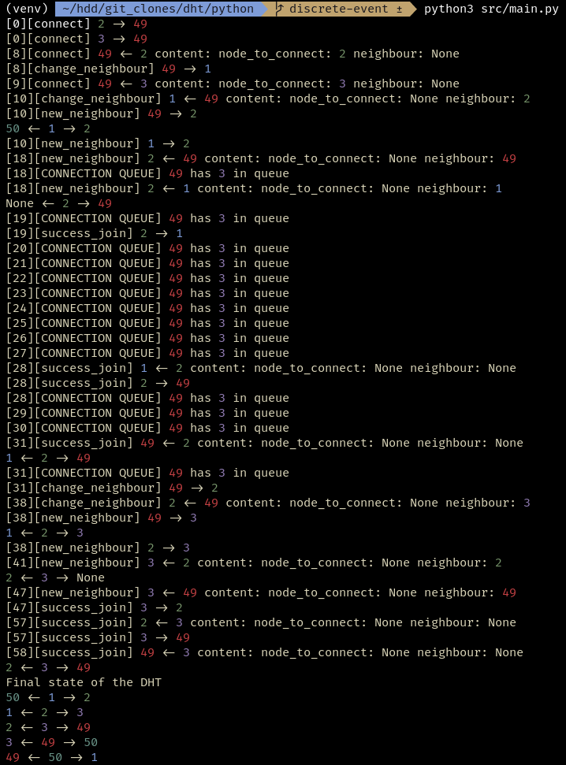

# dhtea

Maxime Paulin, Andrew Mary Huet de Barochez

School project aiming to implement a DHT p2p network.

We developped two version of the DHT. One using discrete simulation in Python, and a real world implementation in Rust.

The goal of the Python implementation was to test node interactions with more ease. 

Before diving into the code we both studied on the paper how we would implement the most basic functions of the DHT, such as the join function.

## Python

### Simpy

We used Simpy for the simulation. The library is very simple and relies on python's yield keyword: it makes the function that is using the keyword a generator.

Generator functions will be executed step by step like iterators, each iteration stopped by a yield keyword.

Simpy uses this mechanism with an environment that is passed to every generator functions in order to set timeouts.

### The implementation

We decided to do the simulation without "cheating". It means that each node cannot access information that it isn't supposed to know.

The architecture of the simulation follows this:

- DHT class acts as the parent of all nodes and contains the simpy environment
- Node class defines the behavior of a node
- Message class defines informations contained in messages

Before running the simulation, we instanciate a DHT class that will create multiple nodes. Some are created with a connected status, the others are disconnected.

Each disconnected node will receive a connected node as a constructor parameter. They will contact this node when the simulation will be ran.

### Concurrent Join Protocol

The disconnected node sends a message with a connect type to the random connected node given in parameter.

The connected node receives the 'connection' request. If there are no connection job pending on this node, the node treats the connection request directly, Otherwise it waits for the other connection to finish.

The connected looks at his neighbours and decide wether it inserts the node as a new neighbour or redirect the request, based on the ID of the new node.

The redirection of the request consist in sending exact same message to a neighbour but with different sender value.

If the new node can be inserted as a neighbour, the connected node block other connection requests until the new node is connected.

Then it sends a 'change neighbour' request to his neighbour. The neighbour respond to the new node with a 'new neighbour' request. The neighbour also block other connection requests until the new node is connected.

The connected node sends a 'new neighbour' request to the new node.

The new node sends a 'success join' to both of his neighbours. The two neighbours unblock their connection queue and treat the other requests.

### Dificulties

Making the join protocol concurrent was the main issue of this project. Indeed, there are many possible situations that the algorithm need to cover.

Adding some randomness to the timeouts helped to find bugs and test different scenarios.

Here is an example of an execution of the code:



In this example both disconnected nodes send a connection request to the node 49. This led to the most obvious problem where the node would change his left neighbour at the same time and it wouldn't work. Adding a connection queue helped to fix this issue.

Nevertheless, there were still another issue when two connection request were made to two neighbour nodes. So we added a blocking boolean for nodes reiceiving a 'change neighbour' request.

There are still some rare scenarios where the join will fail.

### Running the code 

Version of python used: python3.10.10

```shell
python -m venv venv

source venv/bin/activate

pip install -r requirements.txt

python src/main.py
```

## Rust
Please read the readme inside `./rust` ([Here's a shortcut](./rust/README.md)) 
